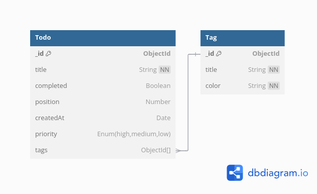

# **Documentation des Nouvelles Tables et Relations**

## **1. Introduction**
Cette documentation détaille les nouveaux modèles ajoutés à la base de données MongoDB : **Tag** et **Todo**. Ces modèles sont utilisés pour gérer les tâches (Todo) et leurs catégories ou labels (Tag). Ils incluent une relation pour associer plusieurs tags à une tâche.

---

## **2. Modèle Tag**

### **Structure de la Table**
| Champ  | Type     | Contraintes       | Description                        |
|--------|----------|-------------------|------------------------------------|
| _id    | ObjectId | PK                | Identifiant unique du tag          |
| title  | String   | NOT NULL, trimmed | Titre ou nom du tag                |
| color  | String   | NOT NULL          | Couleur associée au tag (ex. `#FF5733`) |

### **Description**
Le modèle **Tag** permet de catégoriser ou d'identifier des tâches avec des étiquettes personnalisées, incluant un titre et une couleur pour une meilleure visualisation.

---

## **3. Modèle Todo**

### **Structure de la Table**
| Champ      | Type         | Contraintes             | Description                                      |
|------------|--------------|-------------------------|--------------------------------------------------|
| _id        | ObjectId     | PK                      | Identifiant unique de la tâche                   |
| title      | String       | NOT NULL                | Titre de la tâche                                |
| completed  | Boolean      | Default: `false`        | Statut de la tâche (complétée ou non)            |
| position   | Number       | Default: `0`            | Position de la tâche dans une liste triée        |
| createdAt  | Date         | Default: `Date.now()`   | Date de création de la tâche                     |
| tags       | Array[ObjectId] | FK (ref: Tag)        | Liste des tags associés à la tâche               |
| priority   | Enum[String] | `high`, `medium`, `low` | Priorité de la tâche (par défaut : `medium`)     |

### **Description**
Le modèle **Todo** représente une tâche dans une application de gestion. Chaque tâche peut avoir une priorité, des tags associés, un statut de complétion, et une position pour l'ordre d'affichage.

---

## **4. Relations entre les Modèles**

| Relation       | Type             | Description                                                             |
|----------------|------------------|-------------------------------------------------------------------------|
| Todo → Tag     | One-to-Many      | Une tâche peut être associée à plusieurs tags, mais chaque tag est unique. |

### **Schéma Relationnel**
- **Todo.tags** : Champ qui stocke une liste d'ID d'objets référencés du modèle **Tag**.

---

## **5. Diagramme Relationnel**

